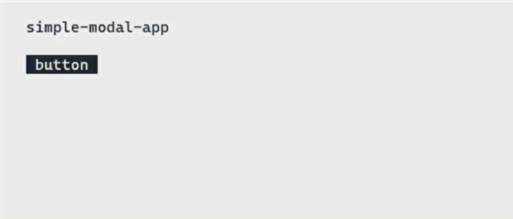

# 💫 realistic-gui

(**under development**)



### 💬 An advanced version of nodecli-gui

- **Widgets**: Panel, Button, Label, Checkbox, RadioButton, Image, Textbox, Webview
- **Presets**: Modal, (create-later)
- **Functions**: TCG (3D CLI Graphic), (create-later)

#### 🎬 **Webview ?**
- Use the Web-related node.js library to take screenshots over the Internet and convert them into text to display

#### 🆕 **TCG ?**
- A 3D engine using cli, and text is drawn on the screen using location and size data.

### 💾 Usage

```jsx
const { CLIApplication, CLIPanel, CLILabel, CLIButton } = require(`realistic-gui`);

const app = new CLIApplication();

const component = <CLIPanel styles={{ "background-color": "#EEEEEE" }}>
    <CLILabel text="simple-modal-app" styles={{ "text-color": "#222831", x: 4, y: 2 }} />

    <CLILabel paths={["root/label1"]} text="open-modal" styles={{ "text-color": "#00ADB5", x: 4, y: 3, visible: false }} />
    <CLIButton text=" button " styles={{ "background-color": "#222831", "text-color": "#EEEEEE", x: 4, y: 4, width: 8, height: 1 }} events={{
        "onPut": () => {
            timeout = setTimeout(() => {
                app.modify(`root/label1`, { styles: { visible: true } });
            }, 500);
        },
        "onLeave": () => {
            clearTimeout(timeout);
            app.modify(`root/label1`, { styles: { visible: false } });
        },
        "onEnter": () => {
            app.modify(`root/modalp`, { styles: { visible: true } });
            app.modify(`root/modall`, { styles: { visible: true } });
            app.modify(`root/modalb`, { styles: { visible: true } });
        }
    }} />

    <CLIPanel paths={["root/modalp"]} styles={{ "background-color": "#222831", "visible": false, x: 8, y: 2, "width": 50, "height": 10 }}>
        <CLILabel paths={["root/modall"]} text="modal-title" styles={{ "text-color": "#EEEEEE", x: 12, y: 3, "visible": false }} />
        <CLIButton paths={["root/modalb"]} text=" close " styles={{ "background-color": "#EEEEEE", "text-color": "#222831", x: 12, y: 4, width: 6, height: 1, visible: false }} events={{
            "onEnter": () => {
                app.modify(`root/modalp`, { styles: { visible: false } });
                app.modify(`root/modall`, { styles: { visible: false } });
                app.modify(`root/modalb`, { styles: { visible: false } });
            }
        }} />
    </CLIPanel>
</CLIPanel>;

app.append(component);
app.show(30);
```